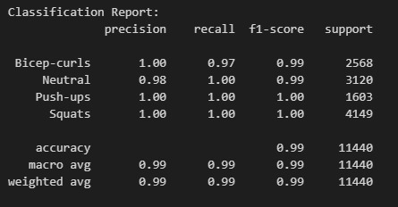

# Smart Fitness Assistant

## Overview
The **Smart Fitness Assistant** is designed to enhance workout experiences by providing real-time feedback and performance tracking. The project flow consists of some features described as follows :

## Key Features
- **Exercise Detection:** The assistant identifies the current workout being performed by the user.
- **Body Orientation Detection:** It then assesses the user's body orientation to ensure proper form and alignment.
- **Repetition Counting:** The system counts the number of repetitions completed for each exercise.
- **Feedback Generation:** Finally, it delivers feedback to the user based on their performance, helping to improve technique and efficiency.
This comprehensive approach aims to support users in achieving their fitness goals while maintaining proper form and reducing the risk of injury.

## Features Descriptions
This section is to explain how each feature works to provide real-time feedback and assistance during your workouts.

### 1) Exercise Detection

The workout detection system is built through a structured process of data collection, processing, and model training, resulting in high-accuracy predictions. Here’s an overview of how this feature works:

1. **Data Collection**: We began by collecting videos for four workout classes (biceps, squats, pushups, and a neutral state) and we have collected data as follows:

| Exercise           | Total Videos         | Video Duration        | Frame Rates          |
|--------------------|----------------------|-----------------------|----------------------|
| Squats             | 45                   | 3 to 10 seconds       | 25-30 fps            |
| Bicep-Curls        | 47                   | 3 to 10 seconds       | 25-30 fps            |
| Neutral            | 246                  | 1 to 3 seconds        | 25 fps               |
| Push-Ups           | 53                   | 2 to 4 seconds        | 22-25 fps            |

2. **Keypoint Extraction**: Using the Mediapipe library, we extracted keypoints from the collected videos.

3. **Data Preparation**: The extracted keypoints were saved into a CSV file, which was then split into training and validation sets using an 80:20 ratio.

4. **Data Scaling**: To ensure consistency and improve the performance of the machine learning model, the keypoint data was scaled using a Standard Scaler.

5. **Model Training**: We employed a Random Forest model, which is known for its robustness and accuracy. The model was trained on the scaled keypoint data, achieving an impressive accuracy of 99.26%.

6. **Result**: With this trained model, the system can accurately detect the workout being performed by the user in real time.

  
  

### 2) Body Orientation

The orientation of the body is determined by calculating the ratio between two distances:
1. **Distance between the shoulder points (left and right shoulder)**.
2. **Distance between the shoulder and elbow on the most visible side**.

If the ratio is greater than **0.6**, the system detects the body as being **front-facing**. Otherwise, it is classified as a **side view**. The side is determined based on the most visible body points from the side.

\[
\text{Ratio} = \frac{\text{Distance between shoulders}}{\text{Distance between shoulder and elbow (most visible side)}}
\]

If:

\[
\text{Ratio} > 0.6 \Rightarrow \text{Frontside} 
\]

Else:

\[
\text{Side}
\]

